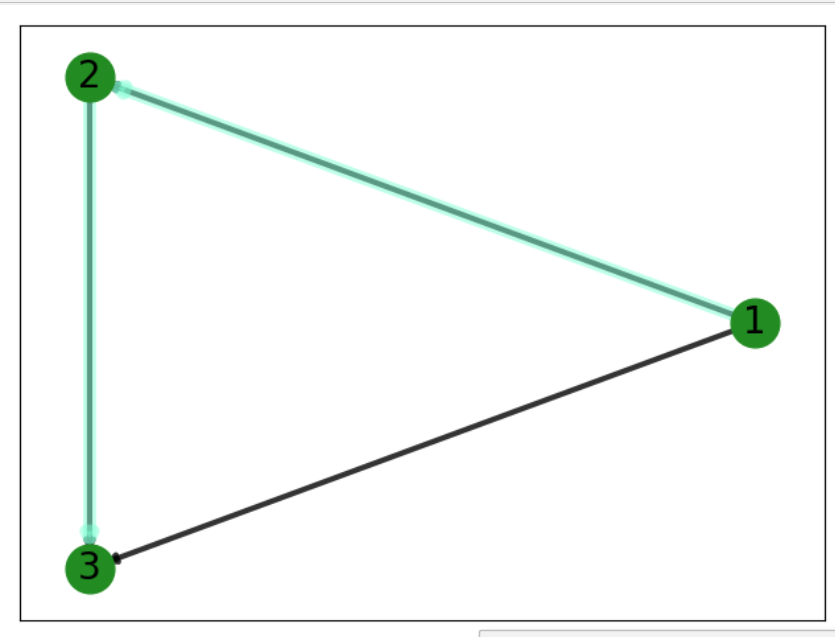

#### Используемые инструменты:
- Операционная система Windows 10 x64
- Интерпретатор языка Python 3.7
- Библиотеки Matplotlib, NetworkX, itertools, math, bellmanford(для отрисовки графа) для Python

#### Алгоритм Беллмана — Форда (O(VE))

Открыть консоль и перейти в директорию, где лежит файл с кодом,  скопировать туда requirments_ford.txt.

Набрать следующие команды:

```
pip install -r requirments_ford.txt
```
```
python main.py
```

#### Результат выполнения

Входные данные :


Результат :




Входные данные :


Результат :


Входные данные :


Результат :


#### Алгоритм Флойда (O(V^3))

Открыть консоль и перейти в директорию, где лежит файл с кодом, скопировать туда requirments_floyd.txt.

Набрать следующие команды:

```
pip install -r requirments_floyd.txt
```
```
python Floyd.py
```
#### Результат выполнения

Входные данные :


Результат :


